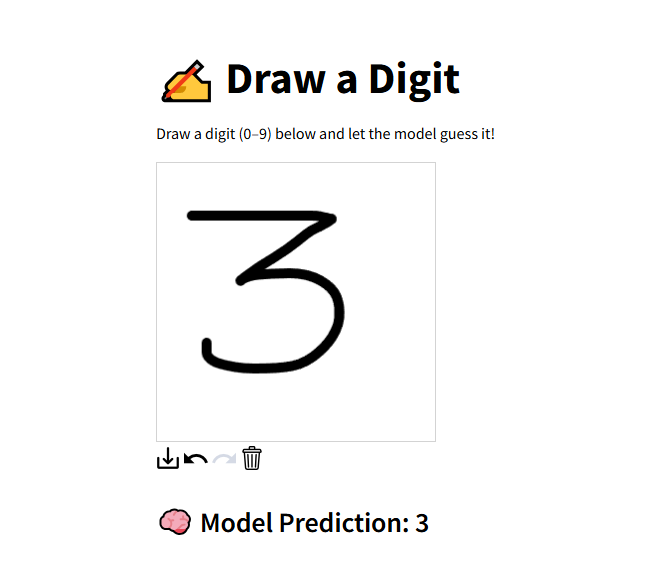

# 🧠 Handwritten Digit Recognition Web App

An interactive web app that recognizes handwritten digits using a Convolutional Neural Network (CNN) trained on the MNIST dataset. Users can draw digits on a canvas, and the model will predict them in real-time.

<p align="center">
  
</p>

## 🚀 Features

- Draw digits (0–9) using a mouse or touchscreen
- Live prediction using a pre-trained deep learning model
- Clean and minimal web interface with Streamlit
- Fully local — runs on your machine with no internet needed after setup

---

## 🛠 Tech Stack

- **Frontend/UI**: [Streamlit](https://streamlit.io/)
- **Drawing Interface**: [streamlit-drawable-canvas](https://github.com/andfanilo/streamlit-drawable-canvas)
- **Model**: Keras (TensorFlow backend) CNN trained on MNIST dataset
- **Backend**: Python

---

## 📦 Installation

### 1. Clone the Repository

```bash
git clone https://github.com/your-username/digit-recognition-streamlit.git
cd digit-recognition-streamlit
```

### 2. Install Requirements

```bash
pip install -r requirements.txt
```

### 3. Train the Model (One-time Step)
```bash
python train_model.py
```
This will create a file mnist_cnn.h5 — the trained model.

### ▶️ Run the App
```bash
streamlit run app.py
```